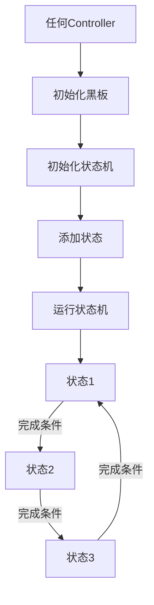

# Brackey-GameJam-2025

# NPC实现

## 概述
用一个状态机系统管理 NPC 的行为状态。支持枚举状态管理、黑板数据共享和状态转移。

### 主要功能
- **状态机管理**：基于枚举类的状态切换系统
- **黑板系统**：状态间数据共享机制
---

## 系统架构

### 文件结构
```
StateMachine/
├── IState.cs              # 状态接口。用于规范状态应该实现的功能标准，不用于实现。
├── BaseState.cs           # 基础状态抽象类。用于被继承，实现具体的状态。
├── StateMachine.cs        # 状态机管理器。可挂载脚本。用于被Controller调用。
└── BlackBoard.cs          # 黑板基类。用于读写数据。

HumanController/
├── HumanStates.cs         # 状态枚举定义
├── HumanBlackboard.cs     # 人物黑板数据
├── HumanController.cs     # 人物控制器
├── HumanIdleState.cs      # 空闲状态
└── HumanMoveState.cs      # 移动状态
```

### 系统流程图


---

## 主要组件

### 1. 状态枚举 (HumanStates)(举例，需要据场景单独实现)
- 枚举类，只作为状态的“名字”使用
- 在`StateMachine`中用一个词典记录每个枚举对应的状态实例

**实现例子：**
```csharp
public enum HumanStates
{
    Idle,    // 空闲状态
    Move,    // 移动状态
    Attack,  // 攻击状态
    Hurt,    // 受伤状态
    Dead     // 死亡状态
}
```

### 2. 基础状态类 (BaseState)
- 抽象基类，提供通用状态功能
- 支持枚举状态转换权限控制

**主要方法：**
```csharp
public virtual void OnEnter()                    // 进入状态
public virtual void OnUpdate()                   // 状态更新
public virtual void OnFixedUpdate()              // 物理更新
public virtual void OnExit()                     // 退出状态
public virtual bool CanTransitionTo(Enum state)  // 检查转换权限
public void RequestTransition(Enum state)        // 请求状态转换
```

### 3. 黑板系统 (HumanBlackboard)(举例，需要据场景单独实现)
- 记录变量和数据

**实现例子：**
```csharp
public class HumanBlackboard : BlackBoard
{
    [Header("Human Config")]
    public Transform humanTransform;
    
    [Header("Human Idle State Config")]
    public float idleDuration;
    
    [Header("Human Move State Config")]
    public float moveDuration;
    public float moveSpeed;
    public float moveRange;
}
```

### 4. 状态机(StateMachine)
- 状态初始化和切换
- 状态行为控制
- 调试日志输出

**主要方法：**
```csharp
public void Initialize(Enum stateType, BlackBoard blackBoard)  // 初始化
public void AddState(Enum stateType, BaseState state)          // 添加状态
private void Update()                                          // 状态的Update函数在这里调用
private void FixedUpdate()                                     // 状态的FixedUpdate函数在这里调用
public bool ChangeState(Enum stateType)                        // 切换状态，状态的进入/退出事件在这里实现
```

---
## 使用方法

### 1. 基本设置

1. 创建空的GameObject
2. 添加必要组件：
   - `Controller` 自行实现的管理类脚本
   - `StateMachine` 组件（自动添加）
   - `Rigidbody2D` 组件
     
### 2. 调试模式

设置 `StateMachine` 中的 `debugMode = true` 后可以在 Console 中看到：
- 状态机初始化信息
- 状态切换日志
- 错误和警告信息

### 3. 运行游戏
检查Console中的日志

---

## 具体案例
一个2D横板场景，实现NPC闲置和移动。

### 空闲状态 (HumanIdleState)
- NPC 停止移动，保持静止状态
- 计时结束后自动切换到移动状态

**逻辑：**
实现一个继承自BaseState的HumanIdleState。重写其中方法。
```csharp
// 实现构造函数，设置可转移状态和黑板
public HumanIdleState(StateMachine stateMachine, GameObject owner) : base(stateMachine, owner)
{
    rb = owner.GetComponent<Rigidbody2D>();
    // 在此处设置允许转移到的状态
    SetCanTransitionToStates(new Enum[]
    { 
        HumanStates.Move,
        HumanStates.Attack,
        HumanStates.Dead
    }); 

    // 在此处设置黑板，读取需要初始化的数据
    if (stateMachine.blackBoard != null)
    {
        humanBlackboard = stateMachine.blackBoard as HumanBlackboard;
        idleDuration = humanBlackboard.idleDuration;
    }
}

public override void OnEnter()
{
    idleTimer = 0f;
    // 停止移动
    rb.velocity = Vector2.zero;
}

public override void OnUpdate()
{
    idleTimer += Time.deltaTime;
    if (idleTimer >= idleDuration)
    {
        // 切换到移动状态
        RequestTransition(HumanStates.Move);
    }
}
```

### 移动状态 (HumanMoveState)
- 随机选择左右移动方向
- 横版游戏移动（只有X轴移动）
- 计时结束后切换到空闲状态

**逻辑：**
```csharp
/*
初始化和HumanIdleState类似
*/

public override void OnEnter()
{
    moveTimer = 0f;
    
    float horizontalDirection = UnityEngine.Random.Range(0, 2) == 0 ? -1f : 1f;
    moveDirection = new Vector2(horizontalDirection, 0f);
}

public override void OnFixedUpdate()
{
    if (rb != null)
    {
        rb.velocity = moveDirection * moveSpeed;  // 应用移动
    }
}

public override void OnUpdate()
{
    moveTimer += Time.deltaTime;
    if (moveTimer >= moveDuration)
    {
        // 切换到空闲状态
        RequestTransition(HumanStates.Idle);
    }
}
```

### 人物控制器 (HumanController)
- 管理NPC的整体行为/属性
- 从外部创建及使用状态机

**组件需求：**
- 必须有状态机组件
- 必须有刚体组件（也可以改成传递刚体参数）

**初始化流程：**

1. 初始化黑板数据
```csharp
// 设置一些状态机需要的参数
public void InitializeBlackboard()
{
    humanBlackboard = new HumanBlackboard();

    humanBlackboard.humanTransform = transform;
    humanBlackboard.idleDuration = 2f;
    humanBlackboard.moveDuration = 3f;
    humanBlackboard.moveSpeed = 2f;
}
```

2. 初始化状态机
```csharp
public void InitializeStateMachine()
{
    // 状态机的初始化需要一个初始状态和黑板
    stateMachine.Initialize(HumanStates.Idle, humanBlackboard);

    // 为状态机添加状态
    stateMachine.AddState(HumanStates.Idle, new HumanIdleState(stateMachine, gameObject));
    stateMachine.AddState(HumanStates.Move, new HumanMoveState(stateMachine, gameObject));
}
```

3. 启动状态机
```csharp
// 开始运行，进入初始状态
stateMachine.RunStateMachine();
```

4. 调用函数
```csharp
// 在Controller中按顺序调用即可
private void Start()
{
    InitializeBlackboard();
    InitializeStateMachine();
    stateMachine.RunStateMachine();
}
```

---

## 版本信息

- **创建日期**：2024年
- **Unity 版本**：Unity 2022.3+ 
- **编程语言**：C#
- **适用场景**：NPC行为管理、2D横版游戏

---
